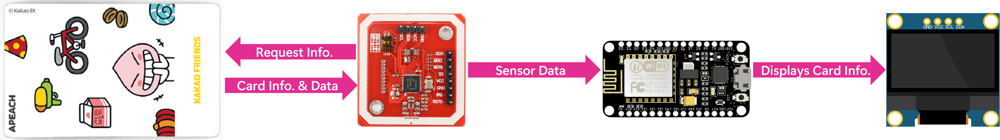
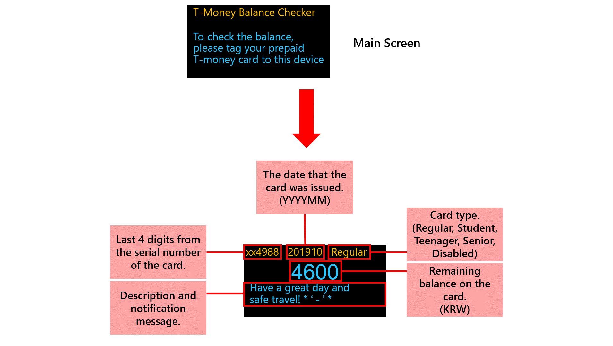
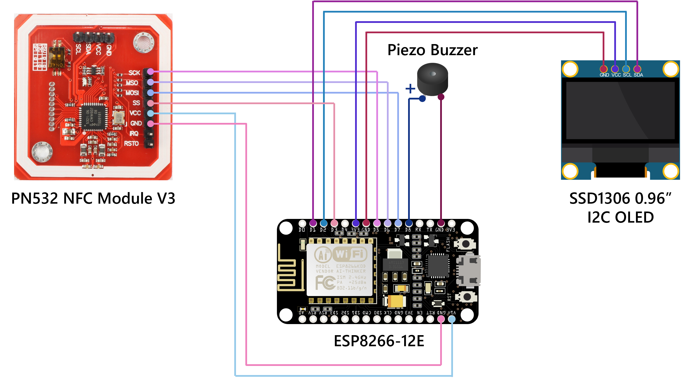

# TMoneyCardBalanceChecker (후불 교통 카드 잔액 확인기)
Tapping the '[Tmoney](https://www.tmoney.co.kr/aeb/main/main/readMain.dev)' card to the NFC module displays the remaining balance on the OLED screen, offers the most intuitive way to check the balance on the card.
 

 

## What's New

Click to Expand

  
### v1.0
#### January 03, 2021
>[Initial release.](https://github.com/happybono/TMoneyCardBalanceChecker/commit/fec9bfa518c8a4e4afe6bc7d3de6c8143084da48)

#### January 05, 2021
>[Added README.md](https://github.com/happybono/TMoneyCardBalanceChecker/commit/ea930c71896c7cd582c2e9f4dfeed69acf5db815)    
>[Comments have added to each function in the source code.](https://github.com/happybono/TMoneyCardBalanceChecker/commit/74afa73fddc93052ed60340b95d96530603bea3d#diff-87f942957af3e245df937cc59e8e84242eb4c3a3b22ce052b06e2693e99a277e)

#### January 11, 2021
>[Updated README.md](https://github.com/happybono/TMoneyCardBalanceChecker/commit/187703a582d8e7e7d24195178be22c34e3c03d52)

### v2.0
#### January 19, 2021
>[Displays more information (Serial number, Date issued, Card type) on the OLED Screen.](https://github.com/happybono/TMoneyCardBalanceChecker/blob/main/K-TransitCardBalance.ino)

#### December 16, 2021
>[Bugs fixed related to the classification of cards.](https://github.com/happybono/TMoneyCardBalanceChecker/blob/main/K-TransitCardBalance.ino)

## Specifications
### Scenarios
- Tapping the card to the NFC module displays the remaining balance and other information retrieved from it on the OLED screen.

     

### Connections
- 1 x Micro-USB

### Wireless
#### Wi-Fi
- IEEE 802.11 b/g/n Wi-Fi technology.
- **Not required to use the Wi-Fi capability** for this project.

#### NFC (Near Field Communication)
- MIFARE 1k, 4k, Ultra light, and DESFIRE cards, **ISO/IEC 14443-4 cards such as CD97BX**, CD light, DESFIRE, P5CN072 (SMX),  INNOVISION Jewel cards such as IRT5001 card, FELICA cards such as RCS_860 and RCS_854
- **Built-in PCB Antenna, with 5 cm to 7 cm communication distance.**
- Host communication : **SPI Interface**
- Operating temperature : **-30ºC to +85ºC**
- **Contactless communication at 13.56MHz**

### Battery life 
* **Up to 9.5 hours (9 hours and 30 minutes)** of typical device usage.
* Testing consisted of **full-time active use** until complete battery discharge. 
* **Wi-Fi** was **not connected to any network**.
* **Dedicated LED indicators on the ESP8266 chipset have been disabled** until the battery is completely exhausted.
* Battery life may vary significantly with settings, usage and other factors.

## Schematics

## Apparatus (Equipment)
### Platform
* NodeMCU ESP8266-12E

### PN532 NFC / RFID Controller
* Soldering required.
* Connection Type : SPI
* D0 : SS of PN532
* D5 : TX of PN532
* D6 : MISO of PN532
* D7 : MOSI of PN532
* GND : GND of PN532
* VIN : VCC of PN532

### 0.96" SSD1306 I2C OLED Display 
* Soldering required
* D2 : Data, D1 : Clock

### A-song Y25 Portable Battery
* USB Port : Power
* Micro-USB : Charging Port
* Dimension : 63.3 mm (W) × 90.7 mm (D) × 13.0 mm (H)
* Input : DC-5V / 2A (Micro 5-pin)
* Output : DC-5V / 2A (2 USB ports)
* Capacity : 5,000 mAh

## Features
* Tapping the 'Tmoney' card to the NFC module displays the remaining balance on the OLED screen.
> The 'Tmoney' card is a rechargeable smart card that can be used to pay public transit fares in the Seoul-Gyeonggi areas as well in other cities around Korea (bus, underground/metro, taxi) as well as purchases in designated areas. The 'Tmoney' card can be used to pay subway and bus and taxi travel.

## Outcome Demonstration

## Libraries Used
### Adafruit-PN532
This is a library for the Adafruit-PN532 NFC / RFID breakout boards This library works with the Adafruit NFC breakout.
https://github.com/adafruit/Adafruit-PN532

### SSD1306 (0.96") OLED Display
This is a driver for SSD1306 128x64, 128x32, 64x48 and 64x32 OLED displays running on the Arduino/ESP8266 & ESP32 and mbed-os platforms. Can be used with either the I2C or SPI version of the display.
https://www.github.com/ThingPulse/esp8266-oled-ssd1306

## Copyright / End User License
### Copyright
Copyright ⓒ HappyBono 2021 - 2022. All rights Reserved.

### MIT License
Permission is hereby granted, free of charge, to any person obtaining a copy of this software and associated documentation files (the "Software"), to deal in the Software without restriction, including without limitation the rights to use, copy, modify, merge, publish, distribute, sublicense, and/or sell copies of the Software, and to permit persons to whom the Software is furnished to do so, subject to the following conditions:
The above copyright notice and this permission notice shall be included in all copies or substantial portions of the Software.
THE SOFTWARE IS PROVIDED "AS IS", WITHOUT WARRANTY OF ANY KIND, EXPRESS OR IMPLIED, INCLUDING BUT NOT LIMITED TO THE WARRANTIES OF MERCHANTABILITY, FITNESS FOR A PARTICULAR PURPOSE AND NONINFRINGEMENT. IN NO EVENT SHALL THE AUTHORS OR COPYRIGHT HOLDERS BE LIABLE FOR ANY CLAIM, DAMAGES OR OTHER LIABILITY, WHETHER IN AN ACTION OF CONTRACT, TORT OR OTHERWISE, ARISING FROM, OUT OF OR IN CONNECTION WITH THE SOFTWARE OR THE USE OR OTHER DEALINGS IN THE SOFTWARE.

## Contact Information
[Jaewoong Mun](mailto:happybono@outlook.com)

## References
* Hyunwoo Nam, Byunggeun Jang, Youngwook Park, 2012, A Design of Card Processing Method based on Script File for AFC Terminal, KoreaScience, Journal of The Korea Society of Computer and Information (JKSCI), viewed 5 January 2021, https://www.koreascience.or.kr/article/CFKO201202135240043.pdf.
