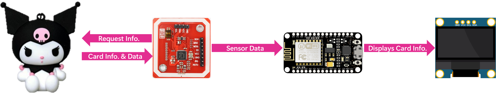

# KoreaTransitCardBalanceChecker (후불 교통 카드 [티머니, 이즐] 잔액 확인기)
Tapping the '[Tmoney](https://www.tmoney.co.kr/)' or '[Ezl (as known as CashBee)](https://www.cashbee.co.kr/)' card to the NFC module displays the remaining balance on the OLED screen, offers the most intuitive way to check the balance on the card.
<br>
<div align="center">
 


</div>

## What's New
<details>
<summary>Click to Expand</summary>
  
### v1.0
#### January 03, 2021
>[Initial release.](https://github.com/happybono/KoreaTransitCardBalanceChecker/commit/fec9bfa518c8a4e4afe6bc7d3de6c8143084da48)

#### January 05, 2021
>[Added README.md](https://github.com/happybono/KoreaTransitCardBalanceChecker/commit/ea930c71896c7cd582c2e9f4dfeed69acf5db815) </br> </br>
>[Comments have added to each function in the source code.](https://github.com/happybono/KoreaTransitCardBalanceChecker/commit/74afa73fddc93052ed60340b95d96530603bea3d#diff-87f942957af3e245df937cc59e8e84242eb4c3a3b22ce052b06e2693e99a277e)

#### January 11, 2021
>[Updated README.md](https://github.com/happybono/KoreaTransitCardBalanceChecker/commit/187703a582d8e7e7d24195178be22c34e3c03d52)

### v2.0
#### January 19, 2021
>[Displays more information (Serial number, Date issued, Card type) on the OLED Screen.](https://github.com/happybono/KoreaTransitCardBalanceChecker/blob/main/K-TransitCardBalance.ino)

#### December 16, 2021
>[Bugs fixed related to the classification of cards.](https://github.com/happybono/KoreaTransitCardBalanceChecker/blob/main/K-TransitCardBalance.ino)

### v3.0
#### February 3, 2022
> [Supports beep sound using the piezo buzzer.](https://github.com/happybono/KoreaTransitCardBalanceChecker/blob/main/K-TransitCardBalance.ino)</br> </br>
> [Supports notification lights using the dedicated LED on the ESP8266 chipset.](https://github.com/happybono/KoreaTransitCardBalanceChecker/blob/main/K-TransitCardBalance.ino)</br> </br>
> [Displays error messages about undetectable cards on the OLED display.](https://github.com/happybono/KoreaTransitCardBalanceChecker/blob/main/K-TransitCardBalance.ino)</br>

#### February 8, 2022
> [Bugs fixed.](https://github.com/happybono/KoreaTransitCardBalanceChecker/blob/main/K-TransitCardBalance.ino)</br>

#### May 15, 2024
> [Added various beep sounds depending on different situations.](https://github.com/happybono/KoreaTransitCardBalanceChecker/blob/main/K-TransitCardBalance.ino)</br>
</details>

## Specifications
### Scenarios
- Tapping the card to the NFC module displays the remaining balance and other information retrieved from it on the OLED screen.

 <br><br><br><br>


### Cards Supported 
- T-Money Cards
- EZL Card (Cash-Bee) Cards

### Cards Not Supported
- RailPlus Cards
- Hanpay Cards

### Connections
- 1 x Micro-USB

### Wireless
#### Wi-Fi
- IEEE 802.11 b/g/n Wi-Fi technology.
- **Not required to use the Wi-Fi capability** for this project.

#### NFC (Near Field Communication)
- MIFARE 1k, 4k, Ultra light, and DESFIRE cards, **ISO/IEC 14443-4 cards such as CD97BX**, CD light, DESFIRE, P5CN072 (SMX),  INNOVISION Jewel cards such as IRT5001 card, FELICA cards such as RCS_860 and RCS_854
- **Built-in PCB Antenna, with 5 cm to 7 cm communication distance.**
- Host communication : **SPI Interface**
- Operating temperature : **-30ºC to +85ºC**
- **Contactless communication at 13.56MHz**

### Battery life 
* **Up to 9.5 hours (9 hours and 30 minutes)** of typical device usage.
* Testing consisted of **full-time active use** until complete battery discharge. 
* **Wi-Fi** was **not connected to any network**.
* **Dedicated LED indicators on the ESP8266 chipset have been disabled** until the battery is completely exhausted.
* Battery life may vary significantly with settings, usage and other factors.

## Schematics


## Apparatus (Equipment)
### Platform
* NodeMCU ESP8266-12E

### PN532 NFC / RFID Controller
* Soldering required.
* Connection Type : SPI
* D4 : SS of PN532
* D5 : TX of PN532
* D6 : MISO of PN532
* D7 : MOSI of PN532
* GND : GND of PN532
* VIN : VCC of PN532

### 0.96" SSD1306 I2C OLED Display 
* Soldering required
* D2 : Data, D1 : Clock

### A-song Y25 Portable Battery
* USB Port : Power
* Micro-USB : Charging Port
* Dimension : 63.3 mm (W) × 90.7 mm (D) × 13.0 mm (H)
* Input : DC-5V / 2A (Micro 5-pin)
* Output : DC-5V / 2A (2 USB ports)
* Capacity : 5,000 mAh

## Features
* Tapping the 'Tmoney'  or 'Ezl (as known as CashBee)' card to the NFC module displays the remaining balance on the OLED screen.
> The 'Tmoney' or 'Ezl' card is a rechargeable smart card that can be used to pay public transit fares in the Seoul-Gyeonggi areas as well in other cities around Korea (bus, underground/metro, taxi) as well as purchases in designated areas. The 'Tmoney' card can be used to pay subway and bus and taxi travel.

<div align="center">


</div>

## Outcome Demonstration
[](https://vimeo.com/672699790 "Outcome Demonstration - Click to Watch!")

## Libraries Used
### Adafruit-PN532
This is a library for the Adafruit-PN532 NFC / RFID breakout boards This library works with the Adafruit NFC breakout.
https://github.com/adafruit/Adafruit-PN532

### SSD1306 (0.96") OLED Display
This is a driver for SSD1306 128x64, 128x32, 64x48 and 64x32 OLED displays running on the Arduino/ESP8266 & ESP32 and mbed-os platforms. Can be used with either the I2C or SPI version of the display.
https://www.github.com/ThingPulse/esp8266-oled-ssd1306

## Code Explanation
### Global Variables
```cpp
SSD1306 display(0x3c, D2, D1); // Object declaration for OLED screen display.
Adafruit_PN532 nfc(PN532_SS);  // Object declaration for NFC capabilities.

char  card_id[16 + 1] = ""; // Card No. (16-bytes)
char  date_issued[8 + 1] = ""; // Date issued. (8-bytes)
char  card_issuer = 0x00;  // Card issuer
char  card_type = 0x00;    // Card type
```

### Setup Function
```cpp
void setup() {
  // Initialize Serial Communication
  Serial.begin(115200);
  delay(50);

  // Initialize LED pin
  pinMode(LED_BUILTIN, OUTPUT);
  digitalWrite(LED_BUILTIN, HIGH);

  // Initialize NFC module
  nfc.begin();
  uint32_t versiondata = nfc.getFirmwareVersion();
  if (!versiondata) {
    Serial.print("Didn't find PN53x board");
    while (1);
  }

  // Display NFC module details on console
  Serial.print("Found chip PN5"); Serial.println((versiondata >> 24) & 0xFF, HEX);
  Serial.print("Firmware ver. "); Serial.print((versiondata >> 16) & 0xFF, DEC);
  Serial.print('.'); Serial.println((versiondata >> 8) & 0xFF, DEC);

  // Initialize OLED display
  display.init();
  display.flipScreenVertically();
  display.display();
  delay(2000);

  // Display initial message
  display.clear();
  display.setFont(ArialMT_Plain_10);
  display.drawString(0, 0, "T-Money Balance Checker");
  display.drawString(1, 17, "To check the balance,");
  display.drawString(1, 29, "please tag your prepaid");
  display.drawString(1, 41, "T-Money card to this device.");
  display.display();
}
```

### Loop Function
```cpp
void loop() {
  uint8_t success;
  uint8_t responseLength = 64;
  success = nfc.inListPassiveTarget();
  if (success) {
    Serial.println("Found something!");
    
    // Read card information
    uint8_t cardInfo[responseLength];
    uint8_t selectApdu[] = { 0x00, 0xA4, 0x00, 0x00, 0x02, 0x42, 0x00 };
    success = nfc.inDataExchange(selectApdu, sizeof(selectApdu), cardInfo, &responseLength);
    if (success) {
      Serial.print("responseLength : "); Serial.println(responseLength);
      nfc.PrintHexChar(cardInfo, responseLength);
      if (responseLength >= 24) {
        CharToHex(cardInfo + 13, card_id, 3); // Card No.
        CharToHex(cardInfo + 21, date_issued, 3); // Date issued
        card_issuer = cardInfo[7]; // Card issuer
        card_type = cardInfo[29];  // Card type
        Serial.print("card number : "); nfc.PrintHexChar(cardInfo + 8, 8);
        Serial.print("date issued : "); nfc.PrintHexChar(cardInfo + 21, 4);
        Serial.print("card issuer : "); Serial.println(issuer_corps((int)card_issuer));
        Serial.print("card type : "); Serial.println(user_type((int)card_type));
      }
    } else {
      Serial.print("Not recognized.");
      display.clear();
      display.display();
      display.drawString(0, 0, ": (  Unrecognized Card!");
      display.drawString(0, 17, "Please tag your prepaid");
      display.drawString(0, 29, "T-Money card to this");
      display.drawString(0, 41, "device.");
      display.display();
      beep_error();
      delay(1000);
      return;
    }

    // Balance inquiry
    uint8_t balance[responseLength];
    uint8_t balanceApdu[] = { 0x90, 0x4C, 0x00, 0x00, 0x04 };
    success = nfc.inDataExchange(balanceApdu, sizeof(balanceApdu), balance, &responseLength);
    if (success) {
      Serial.print("responseLength : "); Serial.println(responseLength);
      nfc.PrintHexChar(balance, responseLength);
      if (responseLength >= 4) {
        char fpsbuf[32] = ""; // Convert numbers to strings for display
        uint32_t credit = balance[0] * 256 * 256 * 256 + balance[1] * 256 * 256 + balance[2] * 256 + balance[3];
        display.clear();
        memset(card_id + 0, 'x', 2); // Extra security
        display.drawString(0, 0, card_id);
        display.drawString(39, 0, date_issued);
        display.drawString(78, 0, user_type((int)card_type));
        dtostrf((float)credit, 10, 0, fpsbuf);
        display.setFont(ArialMT_Plain_24);
        display.drawString(0, 11, fpsbuf);
        display.setFont(ArialMT_Plain_10);
        if (credit < 1700) {
          display.drawString(0, 32, "The balance on your");
          display.drawString(0, 42, "card is critically low.");
          display.drawString(0, 52, "Please recharge it NOW.");
          beep_creditLow();
        } else if (credit < 4000) {
          display.drawString(0, 32, "You have less than");
          display.drawString(0, 42, "4,000 KRW on your card.");
          display.drawString(0, 52, "Please recharge it ASAP.");
          beep();
        } else {
          display.drawString(0, 32, "Have a great day and");
          display.drawString(0, 42, "stay safe while travelling.");
          display.drawString(0, 52, "* ^ - ^ *");
          beep();
        }
        display.display();
        beep();
        Serial.print("Balance left on this card : "); Serial.println(credit);
        Serial.println("");
        delay(3000);
      }
    }
  } else {
    display.clear();
    display.setFont(ArialMT_Plain_10);
    display.drawString(0, 0, "T-Money Balance Checker");
    display.drawString(1, 17, "To check the balance,");
    display.drawString(1, 29, "please tag your prepaid");
    display.drawString(1, 41, "T-Money card to this device.");
    nfc.SAMConfig();
    display.display();
  }
  delay(100);
}
```

### Additional Functions
#### CharToHex: Converts characters to hexadecimal.
```cpp
void CharToHex(uint8_t *ch, char* szHex, int len) {
  unsigned char saucHex[] = "0123456789ABCDEF";
  for (int  i = 0; i < len; i++) {
    szHex[i * 2 + 0] = saucHex[ch[i] >> 4];
    szHex[i * 2 + 1] = saucHex[ch[i] & 0xF];
  }
}
```

#### issuer_corps: Returns the name of the card issuer.
````cpp
char* issuer_corps(int idx) {
  switch (idx) {
    case 1: return "KFTC"; // Korea Financial Telecomunications & Clearings Institute
    case 2: return "A-Cash";
    case 3: return "Mybi";
    case 5: return "V-Cash";
    case 6: return "Mondex Korea";
    case 7: return "Korea Expressway Corp.";
    case 8: return "T-Money"; 
    case 9: return "Korail"; // The Korea Railroad Corporation
````

## Copyright
Copyright ⓒ HappyBono 2021 - 2025. All rights Reserved.

## License
This project is licensed under the MIT License. See the `LICENSE` file for details.

## References
* Hyunwoo Nam, Byunggeun Jang, Youngwook Park, 2012, A Design of Card Processing Method based on Script File for AFC Terminal, KoreaScience, Journal of The Korea Society of Computer and Information (JKSCI), viewed 5 January 2021, https://www.koreascience.or.kr/article/CFKO201202135240043.pdf.

* Chaeum Co., Ltd. (주식회사 채움씨앤아이), 2014, A study on adding the function of a national compatible transportation card to the Book Yieum Pass (Public Library Cards), Ministry of Culture, Sports and Tourism, 공공누리 자료집, viewed 7 January 2021, http://www.codil.or.kr/filebank/original/RK/OTKCRK170036/OTKCRK170036.pdf.
