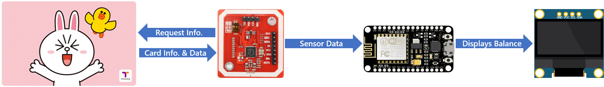

# TMoneyCardBalanceChecker

**Please note : The Google Maps Platform Premium Plan is no longer available for sign up or new customers since November 1, 2018.**

 

## What's New
### January 03, 2021
>[Initial release.](https://github.com/happybono/TMoneyCardBalanceChecker/commit/fec9bfa518c8a4e4afe6bc7d3de6c8143084da48)

## Specifications

## Apparatus (Equipment)

## Features

## Copyright / End User License
### Copyright
Copyright ⓒ HappyBono 2020. All rights Reserved.

### MIT License
Permission is hereby granted, free of charge, to any person obtaining a copy of this software and associated documentation files (the "Software"), to deal in the Software without restriction, including without limitation the rights to use, copy, modify, merge, publish, distribute, sublicense, and/or sell copies of the Software, and to permit persons to whom the Software is furnished to do so, subject to the following conditions:
The above copyright notice and this permission notice shall be included in all copies or substantial portions of the Software.
THE SOFTWARE IS PROVIDED "AS IS", WITHOUT WARRANTY OF ANY KIND, EXPRESS OR IMPLIED, INCLUDING BUT NOT LIMITED TO THE WARRANTIES OF MERCHANTABILITY, FITNESS FOR A PARTICULAR PURPOSE AND NONINFRINGEMENT. IN NO EVENT SHALL THE AUTHORS OR COPYRIGHT HOLDERS BE LIABLE FOR ANY CLAIM, DAMAGES OR OTHER LIABILITY, WHETHER IN AN ACTION OF CONTRACT, TORT OR OTHERWISE, ARISING FROM, OUT OF OR IN CONNECTION WITH THE SOFTWARE OR THE USE OR OTHER DEALINGS IN THE SOFTWARE.

## Contact Information
[Jaewoong Mun](mailto:happybono@outlook.com)

## References
https://www.koreascience.or.kr/article/CFKO201202135240043.pdf
